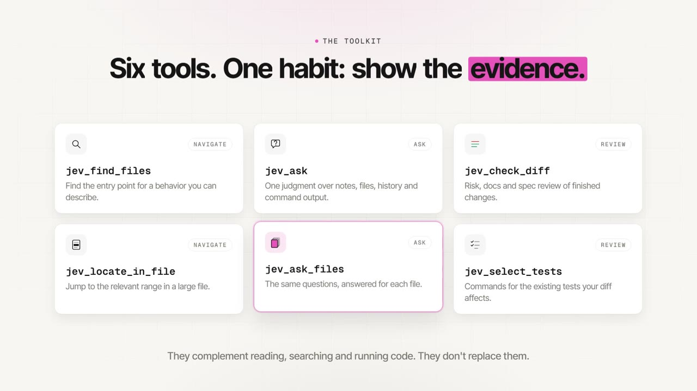

# jev-agent-tools

Six evidence-oriented tools for pi, omp and any MCP client, compatible with the Jev API format. Use them to navigate unfamiliar code, ask typed questions about repository evidence, review completed changes and select existing tests. They complement reading, searching and execution; they do not replace them.

[](docs/media/jev-agent-tools-launch.mp4)

[Watch the launch video](docs/media/jev-agent-tools-launch.mp4) (74 s, MP4).

## Install

Install through your host's package manager, or register the MCP server with an MCP client. The npm package is `jev-agent-tools`. pi and omp load its TypeScript sources directly; the MCP server ships prebuilt.

### pi

```sh
pi install npm:jev-agent-tools@0.2.0
# Project-local installation:
pi install -l npm:jev-agent-tools@0.2.0
```

### omp

```sh
omp plugin install jev-agent-tools@0.2.0
```

### Any MCP client

Since version 0.2.0, the package also ships `jev-agent-tools-mcp`, a stdio MCP server that exposes the same six tools to any MCP client: Claude Code, Claude Desktop, Kiro, Cursor, VS Code, Codex CLI and others. A typical `mcpServers` entry:

```json
{
  "mcpServers": {
    "jev": {
      "command": "npx",
      "args": ["-y", "-p", "jev-agent-tools", "jev-agent-tools-mcp", "--root", "/path/to/repository"],
      "env": {
        "JEV_TOOLS_URL": "${JEV_TOOLS_URL}",
        "JEV_TOOLS_API_KEY": "${JEV_TOOLS_API_KEY}"
      }
    }
  }
}
```

On Windows most clients start commands without a shell, so use `"command": "cmd"` with `"/c", "npx"` at the start of `args`. The [MCP setup guide](docs/mcp.md) has per-client files, CLI commands, variable interpolation, verification and troubleshooting. Releases are also listed in the official MCP Registry as `io.github.NomenAK/jev-agent-tools`. Add the [agent instructions](docs/agent-instructions.md) to `CLAUDE.md`, `AGENTS.md` or a Kiro steering file so the agent uses and reads the tools correctly.

The server reads the same environment variables as pi and omp and the configuration saved by `/jev-setup`. One server process is one session. MCP has no automatic run-end documentation hook; its absence does not require manual replacement calls. `jev_ask` is marked as not read-only while commands are enabled; set `JEV_TOOLS_ALLOW_COMMAND=0` to remove `command` from its schema.

### Requirements and compatibility

Requires Node.js 24 or later. Supported host baselines are pi 0.87.1 and omp 18.4.10. These are support baselines, not claims that every later version has been individually validated. omp uses its Bun runtime; Node.js is also required for Node-based project checks. Git and, for optional command evidence, Bash must be available. On Windows, command evidence uses Git for Windows bash (found next to `git` on `PATH` or under Program Files); the WSL `bash.exe` launchers are never used. Set `JEV_TOOLS_BASH` to the full path of another bash. Optional native parsers and file-search acceleration may be unavailable on some platforms; affected tools report their limitations.

The published `jev-agent-tools@0.1.3` package was also checked with **pi 1.0.0** on Linux under Node.js 24.15.0: npm installation, TypeScript checking against the host types, all six tools in the actual CLI, and reading-guide injection passed. The CLI smoke used a simulated conversation provider and Jev endpoint; it verifies host integration, not live model accuracy or every tool scenario.

**pi 1.0.0 packaging warning:** the package declares `@sinclair/typebox` in `dependencies`, while pi expects host-provided extension modules in `peerDependencies` with a `"*"` range. pi warns that separately installed copies can create duplicate runtime modules. The warning did not prevent the smoke from completing; it remains a packaging issue, not a claim of warning-free compatibility.

## Configure

### Interactive setup

In the main interactive terminal of pi or omp, a first launch without configuration offers **Configure now / Later**. Run `/jev-setup` at any time to change the endpoint, model or key. The key is typed in a masked field and is never passed as a command-line argument. Choose **This session only** (nothing is written) or **Save for future sessions**. Cancelling at any step changes nothing.

| Flag | Effect |
|---|---|
| `--jev-skip-setup` | Suppress the first-launch offer for this run; `/jev-setup` still works. |
| `--jev-url <url>` | Endpoint for this run. |
| `--jev-model <name>` | Jev model for this run, not the conversation model. |

No dialog appears in print, JSON or RPC modes, or in sub-agents; configure those with the environment variables below. Changes apply immediately, without restarting the host.

Interactive setup waits for submission or cancellation, without a credential-entry timeout. The first-launch offer does not keep the host's startup event handler open while you find the endpoint or key.

**Precedence per field:** environment variable, then launch flag, then this session's setup, then saved configuration, then the default model `openjev`. A field set by the environment or a flag is shown as controlled and is never saved.

**Saved configuration** lives outside the repository at `$XDG_CONFIG_HOME/jev-agent-tools/config.json` (default `~/.config/jev-agent-tools/config.json`), in a private directory (`0700`) with a private file (`0600`). On Windows, where mode bits do not exist, privacy is the folder's access list: saving restricts it to you, SYSTEM and Administrators, and loading refuses any other account with access. **The key is stored in plaintext, not encrypted.** Storage that is a symlink, accessible to other users, not owned by you or malformed is refused rather than overwritten. The MCP server also reads this file, after environment variables.

### Environment variables

Set these before starting the host, using your own endpoint and credentials:

```sh
export JEV_TOOLS_URL="${YOUR_JEV_ENDPOINT}"
export JEV_TOOLS_API_KEY="${YOUR_JEV_API_KEY}"
# Optional; already the default:
export JEV_TOOLS_MODEL="openjev"
```

`YOUR_*` placeholders are inputs you supply, not additional product settings. Environment variables are read when the extension loads and take precedence over everything else.

| Variable | Meaning |
|---|---|
| `JEV_TOOLS_URL` | Required complete endpoint URL compatible with the Jev API format. |
| `JEV_TOOLS_API_KEY` | Required Bearer credential; configuration values are not printed in tool output. |
| `JEV_TOOLS_MODEL` | Requested model string, default `openjev`; a moving alias, not a guarantee of served-model identity. |
| `JEV_TOOLS_MAX_CALLS` | Session-wide non-negative safe-integer call limit; absent or empty means unlimited. Invalid values refuse requests. |
| `JEV_TOOLS_MAX_USD` | Session-wide finite non-negative cost limit, including fractions; absent or empty means unlimited. Invalid values refuse requests. |
| `JEV_TOOLS_ALLOW_COMMAND` | `0` disables `command` in `jev_ask`; otherwise commands run with ordinary shell permissions, without an additional sandbox. |
| `JEV_TOOLS_AUTO_DOCS` | `0` disables the automatic run-end documentation check. |
| `JEV_TOOLS_BASH` | Optional full path of the bash used for `jev_ask` commands on Windows. |
| `JEV_TOOLS_ROOT` | MCP server only: repository directory when `--root` is not given. |

Without the endpoint or key, tools remain registered and explain the missing configuration; the automatic documentation check is disabled. There is no fallback to a chat model. Per-tool `max_calls` is separate from session limits. A model name echoed by the response does not establish which model was actually served.

## Choose a tool

| Tool | Choose it when |
|---|---|
| [jev_ask](docs/tools/jev_ask.md) | One judgment combines a note, files, earlier versions or command output. |
| [jev_ask_files](docs/tools/jev_ask_files.md) | The same questions apply independently to each candidate file. |
| [jev_find_files](docs/tools/jev_find_files.md) | You need an entry point for a behavioral goal and do not know its filename. In omp, use native `find` when active. |
| [jev_locate_in_file](docs/tools/jev_locate_in_file.md) | You need the relevant range in one file of at least 19 KB. |
| [jev_check_diff](docs/tools/jev_check_diff.md) | Completed changes need risk, existing-documentation or specification review. |
| [jev_select_tests](docs/tools/jev_select_tests.md) | You need commands for affected existing tests, without running or collecting them. |

Use native read/search tools or code for exact source text, known symbols, filenames, line numbers, counts and arithmetic. Run commands yourself when you need their full output. Tool reference examples use fictional repository paths and are illustrative calls, not recorded executions.

### Evidence root

All six tools accept optional `root: string`. Without it, the host's current directory or configured MCP server directory retains its existing behavior. An override must name exactly the initial repository's Git top-level or a registered live worktree with the same canonical Git common directory. Relative overrides resolve against the initial directory; absolute paths are accepted only for this parameter. Subdirectories, other clones/repositories, parent traversal and symlink components are refused before evidence collection, command execution, cache access or judgment. There is no fallback to a different checkout.

The admitted root governs files, base/diff, inventories, specification paths, runner plans and command cwd for that call only. It does not change another call or the automatic documentation hook. File arguments remain repository-relative and confined. A command still has ordinary shell permissions, not a sandbox. Check the reported authority, requested/effective root and resolved base before using a result.

## Read the results

Each result begins with execution state: **complete**, **partial**, **not_judged** or **refused**. This describes processing, not correctness, safety or coverage. Items distinguish fresh or cached Jev judgments, static treatment and work never judged. Static selection and conservative fallback carry no invented probability. A judged line without an uncertainty mark is a **verdict**: a lead to check, not proof beyond the supplied evidence.

| Mark | Meaning and next action |
|---|---|
| `unsure` | The answer is ambiguous or a control failed. Read the indicated passage or add the specific evidence that would settle it. Do not merely reword the question. |
| `abstain` | A necessary piece is missing. Obtain the named evidence or leave the conclusion open; another Jev call is optional when the changed evidence makes it useful. |
| `no (not shown)` / `not addressed` | The supplied evidence does not show the statement; that does not make it false. |
| `uncalibrated` | No established error-rate calibration applies to this ask; treat it as a hint even if its probability is high. |
| Diagnostics and next actions | Typed cause, origin, affected scope, materiality and recovery instructions; distinguish uncertain judgments from work never judged. |

Ordinary boolean verdict bands are at or below 0.20 and at or above 0.80; category/level verdicts require a leading-option probability of at least 0.85 after applicable controls. Fixed checks and navigation tools have their own thresholds, described in their references and [design](docs/design.md).

Accounting separates **HTTP attempts**, **questions sent**, **requested results** (fresh/cache/static/not judged), **cache probes**, auxiliary controls and passage selection, current reported USD cost and elapsed time. These counts are not interchangeable. A cached judgment can have zero HTTP attempts; zero attempts can also mean static work or no judgment. Unknown cost is unreported, not free. Context values distinguish known, unknown, not collected and not applicable.

pi and omp expose the versioned report as `details.result`. MCP versions from 2025-06-18 expose the same report under `structuredContent.result` with an advertised output schema; older versions receive self-contained text from the same report. Text preserves material limitations, evidence provenance and useful read/runner commands.

Report current conclusions, decisive evidence with origin and scope, and material reservations. If native reading or execution settles an earlier `unsure` or `abstain` on the same context, attribute the current conclusion to that native evidence, not Jev. If uncertainty returned by Jev remains material, explicitly say Jev did not confirm the conclusion and name the missing evidence and impact. Independent limits, stale evidence and conflicting contexts remain visible. Reported checks are not observed execution; no exhaustive history block or new persistent register is required.

## Usage guidance for pi and omp

The extension supplies the shared reading guide in both hosts. omp discovers enabled npm plugin rules during normal startup; pi does not automatically discover the package's `rules/` directory. In pi, the same decision policy is part of the `jev_ask` tool guidelines, so it is present whenever `jev_ask` is active. A forced opaque prompt override may bypass this integration; disabled tools or disabled omp rules are not covered. This README block is recommended usage guidance, not itself an installed instruction:

> Use Jev for a bounded semantic judgment when it can change an open decision or focus inspection. Use decisive native reading, search or authorized execution directly. A Jev call is not a prerequisite for a conclusion, review or completion. When choosing a call, supply both sides of a comparison and the evidence that distinguishes explanations. Revisit only when changed evidence, context or a useful new question warrants it; repeating unchanged evidence is not a recovery action.

MCP clients receive the guide as server `instructions`, which some clients ignore. Add the [agent instructions](docs/agent-instructions.md) to the project's `CLAUDE.md`, `AGENTS.md` or Kiro steering file.

## Data and command safety

Repository evidence, notes and optional command output are sent to your configured endpoint. Review its data-handling policy before using confidential repositories. See [security guidance](SECURITY.md).

File collection is confined to the repository: absolute paths, parent traversal, escaping symlinks, Git metadata and internal URLs are not file inputs. Build output, binaries, lockfiles and oversized files are skipped or refused with visible limits; evidence is not silently truncated into a verdict. This confinement does **not** sandbox a command. `jev_ask` commands can read, write or access the network with the host's shell permissions. omp uses execution approval for commands; pi does not supply an additional per-tool command approval; MCP clients apply their own tool approval, and the server marks `jev_ask` as not read-only. Set `JEV_TOOLS_ALLOW_COMMAND=0` to disable them.

## Automatic documentation check

On a dirty tree, the extension can check existing Markdown documentation once at run end against changes from `HEAD`, including untracked files. A flagged existing sentence can request one additional turn to inspect and update it or explain with evidence why it remains correct; a flag does not itself establish falsehood or require a second call. Merely unsure sections do not trigger another turn. `JEV_TOOLS_AUTO_DOCS=0`, missing configuration, invalid/exhausted session budgets or a clean tree skip the check. Errors and timeout do not block the host. This opt-out host feature does not certify documentation completeness. MCP has no hook and requires no manual replacement ritual.

## Known limits

Static evidence and probability do not prove execution, safety or completeness. Import closure cannot discover every relationship; dynamic code, unsupported syntax and optional parser failures leave explicit gaps. No findings is not proof that unseen callers or documentation are correct. Test selection considers existing discovered scenarios, not whether a new scenario must be added. Session caching cannot establish the identity or stability of a moving model alias.

## Development and contributions

See [CONTRIBUTING.md](CONTRIBUTING.md), [CHANGELOG.md](CHANGELOG.md), [design](docs/design.md) and [architecture decisions](docs/adr/). Development checks run locally without contacting a judgment endpoint:

```sh
npm ci --include=optional
npm run typecheck
npm run check:imports
npm run lint
npm test
```

Internal source modules are implementation details, not a stable library interface.

## License

[MIT](LICENSE).
