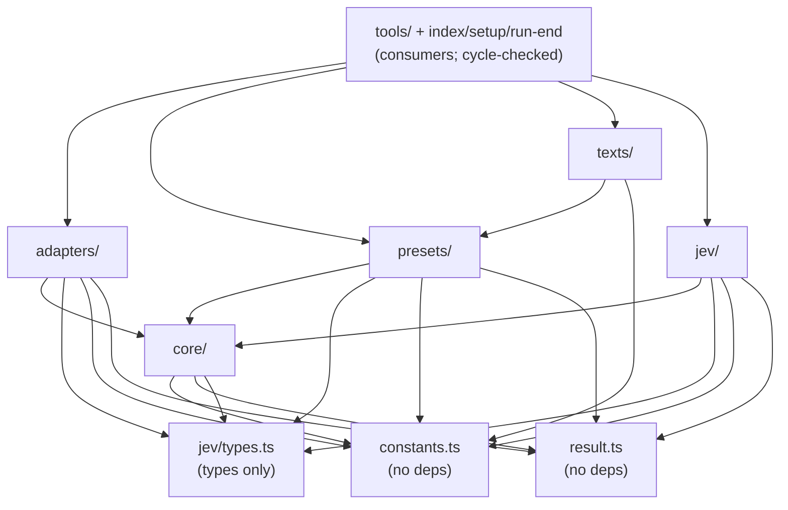

# Architecture: code map

Where everything in `src/` lives, what may import what, how the extension registers on each host, and where a new tool goes. For behavior (pipelines, bands, controls) see [how the tools work](internals/README.md); for thresholds [design](design.md); for durable trade-offs [ADRs](adr/).

## Layering

`src/constants.ts:IMPORT_LAYERS` (ADR 0001) lists the allowed local dependencies per layer, **including erased type imports**. `scripts/check-imports.ts` enforces it via `src/core/import-boundaries.ts:checkImportBoundaries`, which also rejects local import cycles. Pure path operations and erased parser types are explicit exceptions (see [design](design.md)).

In words: `core` is pure (stdlib-only, plus a type-only parser import) and takes only type contracts from `src/jev/types.ts`; `presets` add fixed questions on top of `core`; `adapters` own filesystem/Git/parsing effects on top of `core`; `jev` owns transport on top of `core` batching; `texts` own host-facing copy and may reference `presets`. `constants.ts` and `result.ts` depend on nothing. `tools/` wires it all together per invocation.

## Extension entry point

`src/index.ts` exports `extension(api)`:

1. `detectHost(api)` (`src/host.ts`): omp iff `api.pi !== undefined`; also maps host-specific tool names (filename search is `glob` on omp, `find` on pi).
2. `new ConfigController()` (`src/configuration.ts`) plus `runtime = { session: new Session(readSessionLimits(process.env)), guide: new Guide(host) }` (`src/session.ts`, `src/guide.ts`).
3. `runtime.guide.attach(api)` — reading-guide delivery: system-prompt section on pi, additional context on omp.
4. `session_start`: reset session counters and guide, `clearCache()`; on omp, activate `jev_find_files` when the native `find` is not active.
5. `new Setup(config).attach(api)` — flags, `/jev-setup`, first-launch offer (`src/setup.ts`, `src/secret-input.ts`).
6. `dependencies = { get client(), host, runtime, exec }` (`src/runtime.ts:ToolDependencies`) → `new RunEnd(dependencies).attach(api)` → six `api.registerTool(createXTool(dependencies))` calls (ask, select-tests, check-diff, find, locate, ask-files).

Host differences beyond step 4: `hostUsage` (`src/adapters/usage.ts`) suppresses billing shape on omp; `jev_ask` commands take omp execution approval while pi adds no per-tool approval (see `docs/tools/jev_ask.md`); setup UI appears on TUI main sessions only.

## Code map

### `src/` root

| File | Responsibility |
|---|---|
| `src/index.ts` | Extension entry: builds config/runtime, attaches guide/setup/run-end, registers the six tools. |
| `src/configuration.ts` | `ConfigController`: env/flag/session/saved/default precedence, validation, private `config.json` storage, client lifecycle. |
| `src/constants.ts` | All numeric/string bounds plus `IMPORT_LAYERS`. |
| `src/describe.ts` | `interpolate()` templates; `describeAsk()` builds the `jev_ask` tool description from constants and host names. |
| `src/guide.ts` | `Guide`: host-aware reading-guide text (`GUIDE_TEMPLATE`) delivered per host channel. |
| `src/host.ts` | `detectHost`: omp/pi flag plus host-specific tool names. |
| `src/host-tui.d.ts` | Ambient types for host-loader key helpers. |
| `src/render.ts` | `renderEnvelope()`: envelope lines (answers, entries, limits, yield stats) to text. |
| `src/result.ts` | `Result<T>` ok/error union plus `isRecord()` guard. |
| `src/run-end.ts` | `RunEnd`: the once-per-run automatic docs check on run-end hooks. |
| `src/runtime.ts` | `ToolDependencies` / `ToolRuntime` interfaces shared by every tool. |
| `src/secret-input.ts` | `MaskedSecretInput`: masked, no-history secret prompt widget and contracts. |
| `src/session.ts` | `Session` counters; `readSessionLimits()`: per-session call/USD budgets from env. |
| `src/setup.ts` | `Setup`: CLI flags, config init, interactive first-run offer. |

### `src/tools/` — one module per registered tool, plus shared seams

| File | Responsibility |
|---|---|
| `src/tools/ask.ts` | `createAskTool` (`jev_ask`): note/paths/base/command assembly, integrity, batch judging, envelope. |
| `src/tools/ask-files.ts` | `createAskFilesTool` (`jev_ask_files`): per-file judgments over intents. |
| `src/tools/ask-schema.ts` | `askSchema` / `asksParameter`: TypeBox intent schemas for the ask vs files surfaces. |
| `src/tools/check-diff.ts` | `createCheckDiffTool` (`jev_check_diff`): risk orchestrator; delegates docs/spec to the seams below. |
| `src/tools/docs-check.ts` | `runDocsCheck` seam (also used by run-end); no tool registration. |
| `src/tools/spec-check.ts` | `runSpecCheck` seam; no tool registration. |
| `src/tools/find.ts` | `createFindFilesTool` (`jev_find_files`): rank → excerpt → pointer. |
| `src/tools/judge-options.ts` | `createJudgeOptions` (`gate`, `budget`, `spent`/`reserve`) / `finishToolCall`: shared per-call budget gate and envelope finalization used by every tool and seam. |
| `src/tools/locate.ts` | `createLocateTool` (`jev_locate_in_file`): outline → refine → pointer. |
| `src/tools/select-tests.ts` | `createSelectTestsTool` (`jev_select_tests`): discovery → evidence → pointers → commands. |

### `src/core/` — pure transformations, no I/O

| File | Responsibility |
|---|---|
| `src/core/ask-closure.ts` | `buildAskClosure`: depth-1 import closure over referenced paths. |
| `src/core/ask-proof.ts` | `ProofDeclaration` / `ProofBinding` / `ProofSyntax`: pure AST-evidence data contract. |
| `src/core/ask-references.ts` | `citedPaths` / `resolveAskReferences` / `blockedAskReadings`: explicit path-reference resolution. |
| `src/core/asks.ts` | `Ask` union; `compileAsks` / `readAsks` / `reverseQuestions`: intent compilation and control readings. |
| `src/core/batches.ts` | `prepareBatches` / `splitGroups`: token-budgeted request batching. |
| `src/core/command-output.ts` | `cleanOutput` / `lineShape` / `createRarityCompressor` / `outputChunks` / `selectOutput` / `failureTargets`. |
| `src/core/command-state.ts` | `needsPassageFinding` / `planPassageFinding` / `fitOutputToBudget`: command-output budgeting decisions. |
| `src/core/diff.ts` | `parseDiff` (paths from NUL git metadata, never patch headers); `isTestFile`; hunk types. |
| `src/core/docs.ts` | `docSentences` / `collectDocsCandidates`: sentence splitting and doc-to-declaration attribution. |
| `src/core/find.ts` | `contentWords` / `findKeywords` / `rankFiles` / `retainFiles` / `createExcerptCollector`. |
| `src/core/git.ts` | `GitExec` injectable executor signature. |
| `src/core/import-boundaries.ts` | `checkImportBoundaries`: layer rules, type-contract checks, cycle detection. |
| `src/core/imports.ts` | `createImportGraphBuilder`, `importClosure` / `importClosureLazy`, graph types. |
| `src/core/integrity.ts` | `checkIntegrity` / `FileIdentity`: fingerprint and cited-literal checks. |
| `src/core/lexical.ts` | `tokenize`: comment-stripping lexer (JS/TS + Python). |
| `src/core/locate.ts` | `sectionState` / `sectionStateFits` / `sectionOutline`: budget-fitting locate states. |
| `src/core/output.ts` | Output-line model plus `askBand` band policy and `buildEnvelope`. |
| `src/core/pointer.ts` | `pointerQuestion` / `needsReverse` / `readPointer`: order-controlled choices. |
| `src/core/risk-callers.ts` | `prepareRiskCallers`: static local-caller resolution for risk review. |
| `src/core/runner-version.ts` | `runnerVersion` / `lockedRunnerVersion` (lockfile-only); `VERIFIED_NAME_FILTERS`. |
| `src/core/sections.ts` | `markdownSections`; syntax/heuristic/window sectioning strategies. |
| `src/core/state.ts` | `assembleState`: note + files into a `State` (reserved keys rejected, files never truncated). |
| `src/core/syntax.ts` | `SyntaxRootParser` interface (raw-AST `parse` / `parseRaw`). |
| `src/core/test-commands.ts` | `buildRunnerCommands`: selections to per-runner invocations. |
| `src/core/test-coverage.ts` | `prepareCoverageWitnesses`: synthetic witness questions for residual batches. |
| `src/core/test-discovery.ts` | `Framework` / `TestScenario` / `TestEntry` / `Discovery`: static discovery vocabulary. |
| `src/core/test-discovery/` | `types` (vocabulary) / `shared` (literal, glob, token parsing) / `javascript` / `python` / `go` (per-family scenario extractors). |
| `src/core/test-evidence.ts` | `TestEvidence`: import-graph reachability per test entry. |
| `src/core/test-state.ts` | `prepareTestStates`: setup-mask partition of oversized test states. |
| `src/core/truncate.ts` | `truncate`: surrogate-safe prefix cut. |
| `src/core/units.ts` | `buildUnits` / `heuristicDeclarations`; `EvidenceUnit` / `UnitLimit`. |

### `src/adapters/` — effects (filesystem, Git, parsing, host)

| File | Responsibility |
|---|---|
| `src/adapters/analysis-context.ts` | `createAnalysisContext`: per-invocation fingerprint/tokenizer/parser cache; never cross-call state. |
| `src/adapters/ask-files.ts` | `collectAskFiles`: repo-confined admission + sha256-identified reads. |
| `src/adapters/ask-proof.ts` | `collectAskRepository`: root, known-file inventory, base revision; `read` / `readBefore`. |
| `src/adapters/ask-syntax.ts` | `collectProofSyntax`: declarations/bindings/uses via the shared parser. |
| `src/adapters/command.ts` | `captureCommand`: temp-file execution, compression, failure targets. |
| `src/adapters/docs.ts` | `collectDocsInventory`: eager path inventory, lazy Markdown/source loading. |
| `src/adapters/files.ts` | Repo-filesystem primitives: confinement, admission, `collectFiles`, excerpts. |
| `src/adapters/find.ts` | `prefilter`: git listing narrowed via native `fff` (rg fallback). |
| `src/adapters/git.ts` | Diff/evidence collection: blobs via `parseDiff` + `buildUnits`. |
| `src/adapters/git-base.ts` | `resolveBase`: `base` argument to merge-base with HEAD (default `HEAD`). |
| `src/adapters/git-inventory.ts` | `shareGitInventory`: snapshot-shared `ls-files` within one call. `shareGitTree`: shared `rev-parse --show-toplevel` and base `ls-tree` for the exact argv the diff and caller collectors use; any other form or config setting spawns again. |
| `src/adapters/locate-file.ts` | `readLocateFile`: bounded whole-text or windowed-outline read. |
| `src/adapters/output-lines.ts` | `outputLines`: line streaming with per-line clipping and omission accounting. |
| `src/adapters/risk-callers.ts` | `loadCallerParser` / `collectRiskCallers`: parser plus filesystem-backed caller collection. |
| `src/adapters/runner-version.ts` | `installedRunnerVersion` / `attachRunnerVersions`: confined `node_modules` reads. |
| `src/adapters/syntax.ts` | `loadSyntaxParser` / `loadSyntaxRootParser`: memoized optional ast-grep grammars. |
| `src/adapters/test-inventory.ts` | `collectTestInventory`: root resolution, tracked listing, lazy budget-checked reads. |
| `src/adapters/usage.ts` | `hostUsage`: judgment usage to host billing shape (suppressed on omp). |
| `src/adapters/utf8.ts` | `decodeUtf8` / `createUtf8Decoder` / `verifyGitUtf8`: strict UTF-8 and git-object verification. |

### `src/presets/` — fixed reviewed questions

| File | Responsibility |
|---|---|
| `src/presets/docs.ts` | `prepareDocsCheck` / `readDocsJudgment`: status + sentence-pointer questions. |
| `src/presets/risk.ts` | Builtin dimensions, `prepareRiskMatrix`, `prepareSeverityBatch` (one severity request per unit), witness-health evaluation. |
| `src/presets/spec.ts` | `prepareSpecCheck` / `readSpecJudgment`: per-`REQ-…` conformance + drift. |
| `src/presets/witnesses.ts` | `buildWitnessUnits` / `buildCoverageWitnessUnits` / `evaluateBatchWitnessHealth`. |

### `src/texts/` — host-facing copy

| File | Responsibility |
|---|---|
| `src/texts/ask.ts` | `ASK_DESCRIPTION`. |
| `src/texts/ask-files.ts` | `ASK_FILES_DESCRIPTION`. |
| `src/texts/check-diff.ts` | `CHECK_DIFF_DESCRIPTION`. |
| `src/texts/configuration.ts` | `NOT_CONFIGURED` shared message. |
| `src/texts/find.ts` | `FIND_DESCRIPTION`. |
| `src/texts/guide.ts` | `GUIDE_TEMPLATE` reading guide. |
| `src/texts/locate.ts` | `LOCATE_DESCRIPTION`. |
| `src/texts/run-end.ts` | `runEndMessage(findings)` run-end reminder. |
| `src/texts/select-tests.ts` | `SELECT_TESTS_DESCRIPTION`. |

### `src/jev/` — the only HTTP boundary

| File | Responsibility |
|---|---|
| `src/jev/client.ts` | `createJevClient` (`clearCache`, `judge`): batching, retries, redaction, session caches. |
| `src/jev/pool.ts` | `createPool`: concurrency + rate-limit gate. |
| `src/jev/types.ts` | `Json` / `State` / `Question` / `Answer` / `Judgment` / `JevClient`. |

## Adding a new tool

1. Add `src/tools/<name>.ts` exporting `createXTool(dependencies: ToolDependencies)` (see `createAskTool` in `src/tools/ask.ts` for the shape); pure logic goes in `src/core/`, effects in `src/adapters/`, fixed questions in `src/presets/`, user-facing copy in `src/texts/`.
2. Register it in `src/index.ts` with `api.registerTool(createXTool(dependencies))`.
3. Add the parameter contract as `docs/tools/<tool>.md` and a logic page under `docs/internals/`; if you ship new doc paths outside the existing `package.json` `"files"` globs, extend that list.
4. Add deterministic offline tests under `test/` ([CONTRIBUTING](../CONTRIBUTING.md) requires them) and run `npm run typecheck`, `npm run check:imports`, `npm run lint`, `npm test` — all offline, no key needed.
