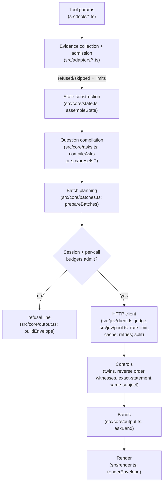

# Internals: how the tools work

How each tool assembles evidence, what it asks Jev, and what its controls do. Grounded in `src/`; every stage names the module and function that implements it.

Parameter contracts, install, configuration, and result marks live elsewhere and are not repeated here:

- [README](../../README.md) — install, configuration, result marks, footer, automatic documentation check
- [Per-tool parameters](../tools/jev_ask.md) ([files](../tools/jev_ask_files.md), [find](../tools/jev_find_files.md), [locate](../tools/jev_locate_in_file.md), [diff](../tools/jev_check_diff.md), [tests](../tools/jev_select_tests.md))
- [Design policy](../design.md) — thresholds, bounds, glossary
- [Architecture decisions](../adr/) — durable trade-offs

## Reading order

1. [Engine](engine.md) — the shared request lifecycle every tool uses: admission, state construction, question compilation, batching, HTTP client (rate limit, retries, cache, budgets), bands, render.
2. Tool logic, in order of generality:
   - [jev_ask](jev_ask.md) — one combined situation: references, import closure, command output, compiled intentions, order/exact-statement controls and a same-subject control asked only for `contradicted` verdicts.
   - [jev_ask_files](jev_ask_files.md) — the same asks judged independently per file.
   - [jev_find_files](jev_find_files.md) — name ranking, excerpt judging, entry-point pointer.
   - [jev_locate_in_file](jev_locate_in_file.md) — section/window choice inside one large file.
   - [jev_check_diff](jev_check_diff.md) — risk/docs/spec presets over before/after evidence units, caller checks, witnesses, severity.
   - [jev_select_tests](jev_select_tests.md) — static test discovery, import-reachability evidence, pointer + residual judgments, runner commands.
3. [Design policy](../design.md#judgment-policy) for the numeric values behind the constant names cited here.

## Shared request lifecycle

All six tools run the same pipeline; they differ only in how they build the state and which questions they compile.

Admission limits refuse or visibly omit oversized evidence; they never silently truncate a file into a verdict. Missing evidence at the end becomes `abstain` or `unjudged`, never a positive verdict. See [engine](engine.md) for each stage.
