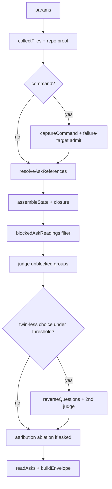

# jev_ask internals

One judgment over one combined situation (note + files + earlier versions + command output). For parameters see [jev_ask](../tools/jev_ask.md).

## Pipeline (`src/tools/ask.ts:createAskTool`)

1. `compileAsks(args.asks, { surface: "ask" })` (`src/core/asks.ts`). At least one of `state`, `paths`, `command` must supply evidence.
2. `collectFiles` (`src/adapters/files.ts`): read `paths` (cap `ASK_MAX_FILES`; per-file probe `STATE_MAX_CHARS * 4 + 1`, char cap `STATE_MAX_CHARS`; files are never truncated). URL schemes rejected; invalid UTF-8 skipped (non-fatal here).
3. `collectAskRepository` (`src/adapters/ask-proof.ts`): `git rev-parse --show-toplevel` inventory, `ls-files` known set, `baseSha`; non-fatal unless `base` was requested.
4. `captureCommand` (`src/adapters/command.ts`) when `command` is set (see below). Repository is re-collected afterwards (the command may have changed the worktree). A note reserving the `output` key together with a command is rejected.
5. Failure-target auto-admit: `failureTargets` signatures from the output suffix-match repo paths (max 20/stream); `discoverTests` (`src/core/test-discovery.ts`) disambiguates test names; additions stop at `ASK_MAX_FILES`. Unidentifiable assertion failures set the `outputNotIdentifiable` flag.
6. `resolveAskReferences` (`src/core/ask-references.ts`): every path cited in question texts or the note (`files["…"]` / `files_before["…"]` selectors, quoted/backtick/slash tokens; URLs stripped) is exact- then suffix-matched; ambiguous/missing references stay `unresolved` (cap `ASK_MAX_FILES` on additions).
7. Re-`assembleState` (`src/core/state.ts`); attach `output`; canonicalize paths via `repositoryPath`; with `base`, `AskRepository.readBefore` supplies `files_before` (absent files are `null`) plus `base_sha`. Serialized state must fit `STATE_MAX_CHARS`.
8. Closure: `createAnalysisContext` (`src/adapters/analysis-context.ts`) + import-graph builder + per-source `collectProofSyntax` (`src/adapters/ask-syntax.ts`), then `buildAskClosure` (`src/core/ask-closure.ts`): depth-1 used declarations and data files not already in evidence, prioritized (mentioned-in-intentions / direct import first), serialized under `state.closure` keys `"path (name)"` within `CLOSURE_MAX_CHARS` and `STATE_MAX_CHARS`. A `closure:` line records additions and gaps; files without an import link are never covered — pass them explicitly.
9. `blockedAskReadings` (`src/core/ask-references.ts`): a reading whose cited reference is unresolved/ambiguous, or whose cited evidence is empty (`files_before: null` exempt — it proves creation), is blocked; its whole group is filtered out of the judgment and later filled `unjudged`.
10. `checkIntegrity` (`src/core/integrity.ts`), then session/`max_calls` admission in `beforeRequest`.
11. Oversized command output takes the passage-finding path (`src/core/command-state.ts:needsPassageFinding` / `planPassageFinding` / `fitOutputToBudget` over `src/core/command-output.ts` chunks): `OUTPUT_CHUNK_CHARS` chunks, at most `OUTPUT_FIND_MAX_CALLS` extra judgments answering "Does this excerpt of a command's output show something failing (a failed test or assertion, a compiler error, a crash, an error message) with its details?", keeping head (`OUTPUT_HEAD_SHARE`) / tail (`OUTPUT_TAIL_SHARE`) context plus scoring chunks (`>= 0.5`), with omission markers. Below `OUTPUT_MIN_BUDGET_CHARS` of room the output is refused outright.
12. `client.judge` (`src/jev/client.ts`) on unblocked groups; blocked ids filled `unjudged`. `reverseQuestions` + second `judge` for twin-less choices under `ORDER_REVERSE_BELOW` (failures become `unjudged`, usage merged). `sameSubjectQuestions` + one more `judge` on the same state for verify readings whose first round is a contradicted verdict; the extra call counts against `max_calls`, and a refused or failed round fills each control `unjudged` with the reason so `readAsks` demotes the contradiction.
13. Attribution ablation per `attributable` locate reading: re-judge without the pointed file (plus its `files_before` entry and `closure` pieces); the limitation line reads `attributed`, `does not rest on it`, or names why the check was unavailable.
14. `readAsks` twice (initial + envelope) → answers; `buildEnvelope` (`src/core/output.ts`) with budget, controls, and limitation lines (output facts, shape limits, ask warnings, integrity notes, attribution).

## Intention compilation (`src/core/asks.ts:compileAsks`)

- `verify`: per claim three first-round questions — `choice` issues question (`not_addressed` / `holds` / `contradicted` / `cannot_tell`, fixed order) + twin with reversed middle options + `bool` exact-statement control. A fourth, the `bool` same-subject control ("Does the evidence in {about} that bears on this statement concern the same subject (same entity, file, version, run and moment) as the statement"), is held back from the first round: `sameSubjectQuestions` sends it in a second call on the same state, and only for readings whose first round is a `contradicted` **verdict** (`src/core/asks.ts:598`). It is not sent for `holds`, `not_addressed` or `cannot_tell`, so the common case costs 3 questions, not 4. The second call counts against `max_calls` like other controls. A second round that is refused or fails leaves the control unjudged, and `readAsks` then reports that reading `unsure` (reason `same-subject control unjudged; no verdict: …`). Claims ending in `?` are rejected; negated/compound/count/date claims warn (Jev does not count — use grep/code) without…
- `classify`: `pick: "many"` fans out to one `bool` per category, else one `choice` with auto-added `other`. Reserved keys (`none`, `other`, `cannot_tell`, `not_addressed`) are rejected when caller-supplied.
- `decide`: one `choice` plus one `bool` control per hypothesis. `rate`: one `score` question; levels must be 2–10 (`SCORE_MIN_LEVELS`, `SCORE_MAX_LEVELS`) concrete situations, never bare low/medium/high.
- `locate`: `count: "many"` fans out to one `bool` per candidate, else one pointer `choice` (`none` + candidates). `attribution` applies to `count: "one"` only.
- `free`: caller-shaped `bool`/`choice`/`score`, always marked `uncalibrated`; choice gains `other` when absent. Choice cardinality is capped at `CHOICE_MAX_OPTIONS`.
- Canonical option order (`canonical` in `asks.ts`): `none`/`not_addressed` first, `other`/`cannot_tell` last, middle hash-sorted.

## Decision logic and controls

- Bands: choice verdicts need mass `>= BAND_CHOICE_VERDICT_MIN`; `cannot_tell >= CANNOT_TELL_MIN` forces `abstain` first; exact-statement disagreements (verify head `holds` with `exact.p < 0.5`, `contradicted` with `exact.p >= 0.5`, `not_addressed`/`cannot_tell` with `exact.p >= BAND_BOOL_YES_MIN`) and decide coherence conflicts (winning hypothesis `p < 0.5`, or `other`/`cannot_tell` winning while some hypothesis `p >= BAND_BOOL_YES_MIN`) downgrade to `unsure` naming raw values. A `contradicted` verdict with same-subject `p < SAME_SUBJECT_MIN` demotes to `unsure` ("evidence may concern a different subject"); a missing or `unjudged` same-subject control demotes it too ("same-subject control unjudged"), since without the control the contradiction is unproven. The same-subject check never affects `holds`/`not_addressed`. Non-`bool` controls and missing reverse answers are `unsure`, never silently dropped. Unsure `score` answers whose two most probable levels are non-adjacent carry a "split between non-adjacent levels i and j" reason.
- Order control: every verify claim has a twin; other choices get a reversed re-judgment when the leading mass is below `ORDER_REVERSE_BELOW` (`reverseQuestions`), except when reversal would not permute the presented order (0 or 1 substantive option): a byte-identical twin would hit the client cache, so no re-ask is scheduled and the answer is read without an order control. `readAsks` averages both runs and sets `orderDependent` when they differ by more than `ORDER_DISAGREE_MIN`. Values: [design policy](../design.md#judgment-policy).

## Command handling (`src/adapters/command.ts:captureCommand`)

Runs `bash -c` at the repo root with `CI=1` and ordinary shell permissions — no sandbox — into private temp files (cleaned up). Commands inherit the host environment, including `JEV_TOOLS_API_KEY`; the host exec API offers no environment override, so never assume secrets are hidden from commands — pass only what the command needs, and note the key value is redacted from judgment payloads, not from command environments. Streams over `OUTPUT_FILE_MAX_BYTES` (64 MiB) are refused after execution (no disk/execution cap); timeout gives `exit_code: null`, `timed_out: true`. Lines are ANSI-stripped, capped at `OUTPUT_LINE_MAX_CHARS`, and rarity-folded (digit→`0`, word→`x`, runs at `OUTPUT_REPEAT_MIN` with `[... N repetitive lines ...]` markers; grouping disables past `OUTPUT_SHAPE_MAX_COUNT`). Failure windows keep `OUTPUT_FAILURE_WINDOW_LINES` around anchors (`failureTargets`: pytest/python/go/npm/tsc patterns). `JEV_TOOLS_ALLOW_COMMAND=0` removes the parameter entirely. Command judgments bypass the session cache.

## What Jev sees vs what stays local

Jev sees: the assembled state (`state`, `files`, `files_before`, `base_sha`, `closure`, `output` with command/exit/timed-out/stdout/stderr) and the compiled wire questions. It never sees file contents or raw output beyond what is in the state, and it does not count, chain inferences, or notice absent pieces — a missing piece reads as "no". Local-only: repository reads, git plumbing, closure graph, reference resolution, batching, controls, bands, render. The agent receives answers, never the assembled state contents.

