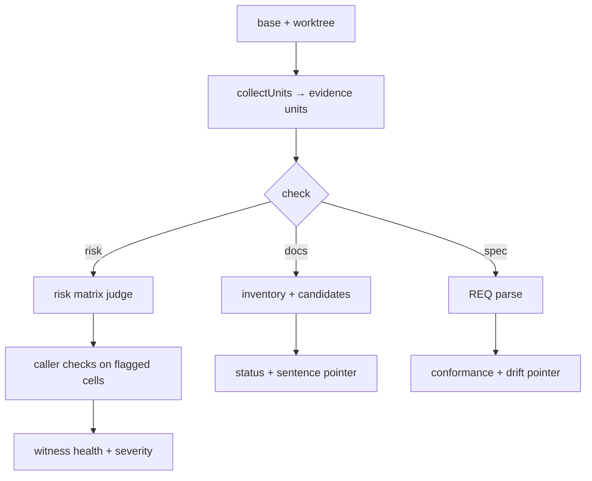

# jev_check_diff internals

Fixed risk / existing-documentation / specification review over a finished diff. For parameters see [jev_check_diff](../tools/jev_check_diff.md). For caller-written judgments about a change use [jev_ask](./jev_ask.md); for test selection [jev_select_tests](./jev_select_tests.md).

Shared groundwork: `resolveBase` (`src/adapters/git-base.ts`) resolves the comparison ref (default `HEAD`); `collectUnits` + `collectDiff` (`src/adapters/git.ts`) parse NUL-separated diff metadata, read worktree and blobs (`readWorktree`/`readGitBlobs`, batched at `GIT_BLOB_BATCH_SIZE`), and `buildUnits` (`src/core/units.ts`) slices changed files into evidence units — functions, slices of large functions, declarations, config files, else hunks with `UNIT_CONTEXT_LINES` context, each truncated to `UNIT_MAX_CHARS` and numbered `uNNN`. Test files (`isTestFile` in `src/core/diff.ts`) are supporting evidence, never units. Unparseable pieces become `UnitLimit` entries (`binary_ignored`, `too_large`, `unreadable`, non-UTF-8, `truncated`, `grammar_absent`, `parse_partial`). States carry `changedUnits` before/after; tests stay aside as evidence.

## risk (`src/presets/risk.ts`, orchestrated by `src/tools/check-diff.ts:createCheckDiffTool`)

1. `prepareRiskMatrix` (+ `normalizeProjectDimensions`, `riskQuestion`, `isBuiltinRiskDimension`): four builtins — security, compatibility, correctness, reliability — each crossed with every unit into cells (`${unit.id}:${dimension.name}`, grouped per unit). Caller `dimensions` add uncalibrated rules (built-in names reserved); `only` restricts the set.
2. `prepareBatches` + `judge` (`src/core/batches.ts`, `src/jev/client.ts`).
3. `collectRiskCallers` (`src/adapters/risk-callers.ts`) for flagged cells only: `prepareRiskCallers` (`src/core/risk-callers.ts`) statically resolves tracked callers of replaced member accesses — literal-name discovery with import-alias resolution (`resolvePath`/`resolveIdentifier`/`resolveScopedIdentifier`/`resolveExpression`/provider) — within `CLOSURE_MAX_CHARS` / `STATE_MAX_CHARS` / `UNIT_MAX_CHARS` budgets, then judges one `new_failure` vs `cannot_tell` question per eligible unit (once per unit, not per caller). Dynamic access that never names the target is uncoverable; unknown providers, partial units, and metaprogramming stay visibly unchecked.
4. `evaluateWitnessHealth` (via `src/presets/risk.ts`, witnesses from `src/presets/witnesses.ts:buildWitnessUnits`): decoy/étalon cells ride the same batches; unhealthy batches demote their real findings to `unsure`. `witnesses: "off"` disables; `auto` (default) engages past `WITNESS_AUTO_MIN_CELLS`.
5. `prepareSeverityBatch`: one severity request per unit — every flagged dimension of that unit shares one state (unit plus caller evidence), and each dimension gets its own 0–3 impact `score` question naming the unit, file, and dimension (`${unit.id}_${dimension}`), rendered as a `severity X/3` suffix. Batching packs the unit's scores into a single request.
- Finding gate: bool `p >= FLAG_MIN` is a verdict; local-caller mass between `BAND_BOOL_GRAY_A` and `FLAG_MIN` is `unsure`, `cannot_tell >= CANNOT_TELL_MIN` is `abstain` naming the missing provider/binding. Caller display merges evidence spans capped at `CALLER_DISPLAY_MAX_SPANS`. All values: [design policy](../design.md#judgment-policy).

## docs (`src/tools/docs-check.ts:runDocsCheck`, `src/presets/docs.ts`, `src/core/docs.ts`)

1. `collectUnits` plus `collectDocsInventory` (`src/adapters/docs.ts`: Markdown + `package.json`/`tsconfig*.json`) in parallel.
2. `collectDocsCandidates` (`src/core/docs.ts`: `docsDeclarationSearch`, changed-file and lexical matching, deadline `DOCS_COLLECT_BUDGET_MS`): at most `DOCS_MAX_SECTIONS` sections; name/anchor bookkeeping capped at `DOCS_NAME_MAX_FILES` / `DOCS_ANCHOR_MAX_FILES`. Overflow is omitted/`unjudged` with a `collection_budget` limit — never an exhaustive-miss proof.
3. `prepareDocsCheck`: per candidate a status `choice` (`unrelated` / `still_true` / `now_false`) plus a sentence pointer over `DocSentence` ids (`docSentences` in `src/core/docs.ts`). Past `CHOICE_MAX_OPTIONS` sentence options including `none` the candidate is left `unjudged` naming the section, without sending either question. `readDocsJudgment`: `now_false` mass `>= DOCS_CHECK_MIN` surfaces the section for manual checking; verdict needs `FLAG_MIN` plus a designated sentence, else `unsure`. Display caps at `DOCS_DISPLAY_MAX_SECTIONS`.
4. This is the only preset that also runs automatically at run end (see [engine](./engine.md)); interactive risk/spec runs share the same code path.

## spec (`src/tools/spec-check.ts:runSpecCheck`, `src/presets/spec.ts`, `src/core/sections.ts`)

1. `collectUnits` plus `collectFiles` of `spec_path` (required, inside the repo).
2. `prepareSpecCheck`: `markdownSections` parses level-3 `### REQ-…` headings into `SpecRequirement`s (`{ id: reqN, label, text }`); per requirement a `choice` (`not_touched` / `conforms` / `violates`) plus a drift pointer over unit ids. Past `CHOICE_MAX_OPTIONS` unit options including `none` the drift pointer is omitted: requirements are still judged while drift stays `unjudged` with a limitation naming it. Markdown tables add an explicit interpretation limit (`tableWarning` pattern); a document without requirement headings is not treated as a specification.
3. `readSpecJudgment`: `violates` mass and drift (`1 − p(none)`) each gate at `FLAG_MIN`; spec text is passed as evidence, and Jev has no instruction/data separation, so specification wording can sway an answer.

## Controls and failure modes

- Witness failures, failed caller controls, and parser gaps demote to `unsure` with raw values and reasons; they never promote findings. `max_calls` bounds everything (matrix, callers, controls, severity); unjudged units/callers/sections/requirements/severity are named. No findings is not proof of safety, caller coverage, or documentation completeness. Missing configuration refuses judgment without a chat-model fallback.

## What Jev sees vs what stays local

Jev sees before/after unit texts (plus caller evidence, doc sections/sentences, or requirement texts for docs/spec) and the fixed reviewed questions — it does not run code. Local-only: diff parsing, unit slicing, caller resolution, candidate collection, batching, witness health, severity, bands, render.

