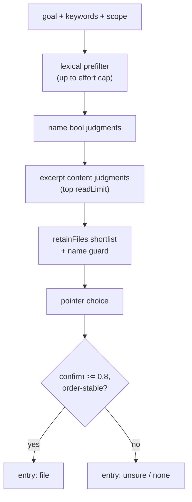

# jev_find_files internals

Rank repository files for a behavioral goal and name the entry point to read first. For parameters see [jev_find_files](../tools/jev_find_files.md). When candidates are already known, [jev_ask_files](./jev_ask_files.md) asks about them directly.

## Pipeline (`src/tools/find.ts:createFindFilesTool`)

1. Lexical prefilter (`prefilter` in `src/adapters/find.ts`): `contentWords` + `findKeywords` from goal/keywords rank tracked files; pages are bounded by `FIND_GREP_PAGE_SIZE`, `scope`/`exclude` enforced by `pathAllowed`. Candidate cap follows `effort`: `FIND_QUICK_CANDIDATES` (32) / `FIND_NAME_CANDIDATES` (128) / `FIND_THOROUGH_CANDIDATES` (256). Deterministic pre-ranking prefers lexical goal matches in paths (`FIND_PATH_WEIGHT`).
2. Name judging: candidates judged in batches of `FIND_NAME_BATCH` with `bool` questions; `rankFiles` (`src/core/find.ts`) orders them. Goals under `FIND_GOAL_MIN_WORDS` content words are accepted but capped at `unsure` — a behavioral sentence beats a guessed identifier.
3. Excerpt judging: the top `readLimit` (`FIND_QUICK_READ` 8 / `FIND_FILES_READ` 20 / `FIND_THOROUGH_READ` 40) are read via `collectSearchExcerpts` (`src/adapters/files.ts`, `FIND_READ_CHUNK_BYTES` chunks); `createExcerptCollector` builds keyword-selected excerpts (leading context `FIND_EXCERPT_HEAD_CHARS`, caps `FIND_EXCERPT_CHARS` / pointer `FIND_POINTER_EXCERPT_CHARS`). Content `bool` judgments run in batches of `FIND_READ_PER_CALL`.
4. Shortlist (`retainFiles` in `src/core/find.ts`): keep excerpts at `p >= FIND_CONTENT_MIN` up to `FIND_POINTER_MAX` (8), plus the name guard — a leading name candidate at `p >= FIND_NAME_GUARD_MIN` within the top `FIND_NAME_GUARD_TOP` survives a weak excerpt.
5. Entry choice: `pointerQuestion` + `readPointer` (`src/core/pointer.ts`) over the shortlist, with the `needsReverse` order check. Confirmation needs `p >= FIND_CONFIRM_MIN`; anything weaker, order-sensitive (past `ORDER_REVERSE_BELOW` / `ORDER_DISAGREE_MIN`), or short-goaled reports `entry: unsure` with the two leaders. `entry: none` means no candidate fit the supplied scope/evidence. All values: [design policy](../design.md#judgment-policy).

## Controls and failure modes

- Excluded, unreadable, or oversized evidence and exhausted budgets end the run at the best-ranked work so far with explicit omissions — the ranked list is an estimate over judged excerpts, not a repository-wide irrelevance proof. Name guards and keyword pre-ranking do not prove omitted files irrelevant.
- Optional native search acceleration may fall back to the slower collection path; the evidence guarantee does not widen. Session budgets stay separate from `max_calls`.
- Missing configuration refuses judgment without a chat-model fallback.

## What Jev sees vs what stays local

Jev sees bare paths at the name stage, then bounded excerpts — never whole files, never the repository. Names help ranking but do not establish behavior. Local-only: lexical pre-ranking, excerpt selection, shortlist math, pointer reading, render. Paths and probabilities are not source text: read the entry before editing.

