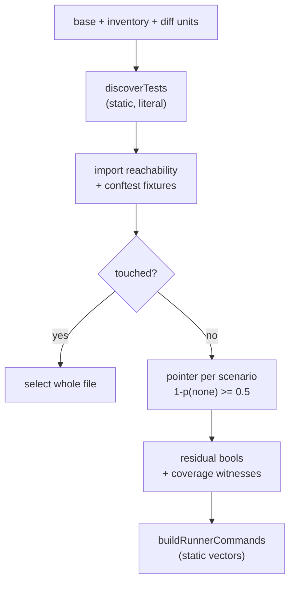

# jev_select_tests internals

Select affected existing tests from a diff and return runner commands — without running or collecting anything. For parameters see [jev_select_tests](../tools/jev_select_tests.md). For risk review see [jev_check_diff](./jev_check_diff.md).

## Pipeline (`src/tools/select-tests.ts:createSelectTestsTool`)

1. `resolveBase` (`src/adapters/git-base.ts`), then `createAnalysisContext` (`src/adapters/analysis-context.ts`: per-invocation only, never retains repo data; `fingerprint`/`tokenizeSource` cached per call; parser is `loadSyntaxRootParser()`, undefined when the optional native parser is missing) + `collectTestInventory` + `collectUnits` in parallel. Inventory (`src/adapters/test-inventory.ts:collectTestInventory`) roots at `git rev-parse --show-toplevel`, lists tracked files minus ignored (except `package`/`tsconfig*.json`), and lazily reads sources in stride-16 batches capped by `TEST_SOURCE_MAX_BYTES` and `TIMEOUT_MS`.
2. Two-pass `discoverTests` (`src/core/test-discovery.ts`): pass one records candidate/config path references; pass two emits the `Discovery` (`entries`, `evidence`, `limits`). Discovery is pure and static — literal configuration only, no third-party code evaluation.
3. `attachRunnerVersions` (`src/adapters/runner-version.ts`): installed `node_modules/<runner>/package.json` first (realpath-confined, `RUNNER_PACKAGE_MAX_BYTES`), else resolved lockfile versions (`lockedRunnerVersion` in `src/core/runner-version.ts`: strict semver via `runnerVersion`, never ranges); vitest/jest/mocha entries only.
4. One lazy import graph over test entries + diff units + `conftest.py`, then `prepareTestEvidence` per entry (`src/core/test-evidence.ts`): changed units reachable through imports **including unchanged intermediates** plus pytest `conftest` fixtures; `usedBy` maps each unit to its importing test sources; unresolvable/dynamic chains stay judgeable but mark the candidate `uncertain`, which falls back to the whole diff as evidence (conservative). Touched tests (`changed.has(entry.path)`) skip judgment: selected whole-file, answer head `touched`, `p = 1`.
5. `prepareTestStates` (`src/core/test-state.ts`): states that fit `STATE_MAX_CHARS` go in one batch; otherwise a setup-mask partition (lines outside all scenario ranges become a shared setup prefix; scenarios greedily packed by serialized size). Rangeless or alone-overflowing scenarios become `unjudged` (whole-file select + `required test evidence omitted` limit).
6. Pointer judgments: one `choice` per scenario asking which changed unit appears in the code that scenario runs, as shown in the state — the test body plus the reached functions the import reachability already placed there (options unit ids + `none`). The model judges shown code rather than tracing calls. Past `CHOICE_MAX_OPTIONS` unit options including `none` the pointer is skipped: every scenario stays selected with an `unjudged` entry naming the cap, which is the conservative outcome. Selected when `1 − p(none) >= SELECT_MIN`; missing/invalid answers select too. Coverage records the max per-unit mass.
7. Residual bool judgments for exported units still below `SELECT_MIN` and reachable from the candidate (or any unit when `uncertain`/outside): one `bool` per (scenario, unit) (`${scenario.id}_${unit.id}`) plus coverage-witness questions (`prepareCoverageWitnesses` in `src/core/test-coverage.ts`, templates from `buildCoverageWitnessUnits` in `src/presets/witnesses.ts`). `p >= SELECT_MIN` selects the scenario. Units still uncovered become `changed, run by no discovered test` lines — inventory-only, banded `unsure` when discovery was incomplete, never a global-coverage claim.
8. `buildRunnerCommands` (`src/core/test-commands.ts`): groups by (cwd, framework, config, project, executable); static vectors only.

## Discovery details (`src/core/test-discovery.ts`)

- `TestEntry` carries framework (vitest/jest/node/bun/playwright/go/pytest/ava/mocha/deno/unknown), `runnerVersion`, cwd/config/project, `invocation` (`runner` vs `typecheck`), scenarios, `countKnown`, and `kind` (runtime vs types). `TestScenario` carries id, name, reliability, and range/name parts/ancestors.
- Unreliable scenarios (dynamic names, un-id'd parameters, duplicates, exclusive mocha, missing callbacks) clear `countKnown`. Non-literal config tokens (shell metacharacters in scripts, unparseable `vitest.workspace`, mocha `extends`/incomplete, ava/deno incomplete) mark groups incomplete or refuse commands (`commandRefusal`, e.g. "Mocha configuration is not statically resolved").
- Runtime/type separation: type files/groups become `kind: types` entries emitting the ancestor `tsc -p/--project` command as-is (project scope, no file/name filter); types entries without a covering typecheck invocation get a limit and no command.

## Commands and name filters (`src/core/test-commands.ts`, `src/core/runner-version.ts`)

- Whole-file commands when: `scenarioIds == null`, `!countKnown`, id mismatch, selected share `>= SELECT_FILE_SHARE` (80%), or unreliable/dynamic names — fragile name selection is never emitted. Mixed whole-file + filtered selections in one group collapse to whole-file.
- Name filters (`-t`/pattern `^name$` joined by `|`) apply only for vitest/jest/mocha whose locked/installed version matches `VERIFIED_NAME_FILTERS` (vitest 3.2.x/4.1.x `' '`, 5.0.x `' > '`; jest 30.x; mocha 11.8.0) with `nameParts` present where the separator needs them; otherwise the pattern is dropped with a `name filter skipped` limit.

## Controls and failure modes

- Residual witness gating: `witnesses: "off"` disables; `auto` (default) engages at `units × scenarios >= WITNESS_AUTO_MIN_CELLS`; `on` always. Witness failures mark units incomplete and ignore the answer (`evaluateBatchWitnessHealth` in `src/presets/witnesses.ts`, decoy cap `COVERAGE_WITNESS_LURE_MAX`, étalon `WITNESS_ETALON_MIN`) — a setup check, not execution.
- Jev-unavailable or state-overflow failures set `fallback: all` (every candidate whole-file + limit); budget/`max_calls` exhaustion instead keeps per-entry whole-file selection. Both preserve tests, never drop them. `paths` narrowing also narrows the inventory the coverage lines apply to.
- Static discovery cannot infer missing test obligations; new-scenario need is never decided here.

## What Jev sees vs what stays local

Jev sees per-entry states (`testFile`, reachable `changedUnits` enriched with `usedBy`, imports) and pointer/residual questions — never the repository, never executed tests. Local-only: inventory, discovery, graph reachability, state partitioning, command planning, bands, render.

